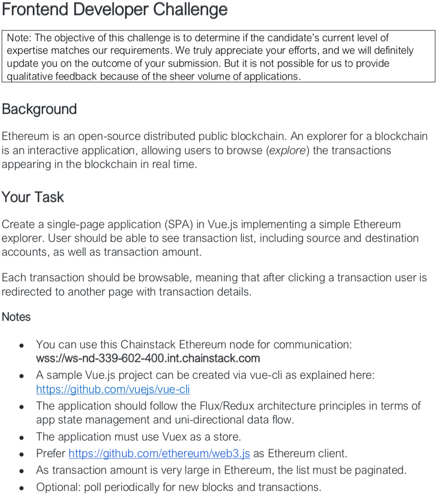
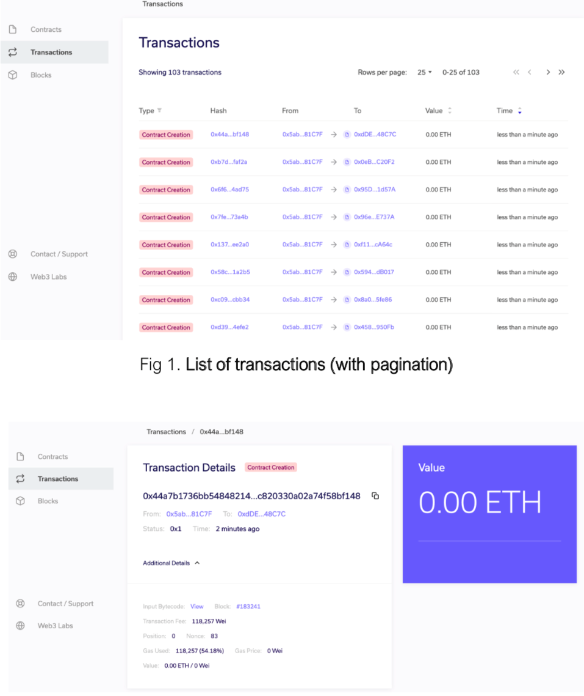
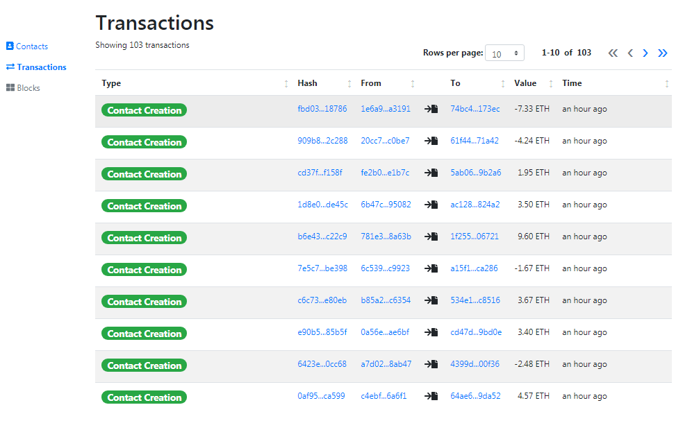
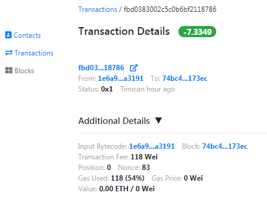
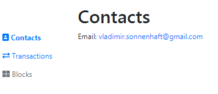

# Vue transactions paginatable-table

demo [here](https://sonnenhaft.github.io/vue_paginatable-table) 

## Project setup
```
npm install
```

### Development
```
npm run serve
```
Will run project for dev env on http://localhost:7777 

### Build
```
npm run build
```

Build will be done to docs folder, if you push to master, demo will be (in few minutes) available on github pages on https://sonnenhaft.github.io/vue_paginatable-table so feel free to push content of /docs folder if it changed.

### Lint, with fix - just simple eslint from vue-cli
```
npm run lint:fix
```
### Task

#### Description


#### Design


### Current look and feel




### What not done
1. I did not wrote tests, my views may not completely match design.
2. There is no way to load all transactions, so I am fetching limited amount (first 10 blocks of transactions).
3. I did not know how to calculate or render some values in transaction page and marked them instead with question mark "?"
4. Instead of messy VueX was used MobX
5. Not really handling api errors (same as user's network errors), same as don't know what to render as "transaction type"
6. Not adding refresh by interval (pooling) since from begin can not fetch all transactions 
7. Node "ws-nd-339-602-400.int.chainstack.com" was not working, instead used "rinkeby.infura.io"